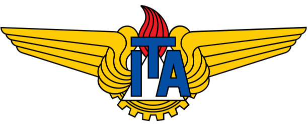
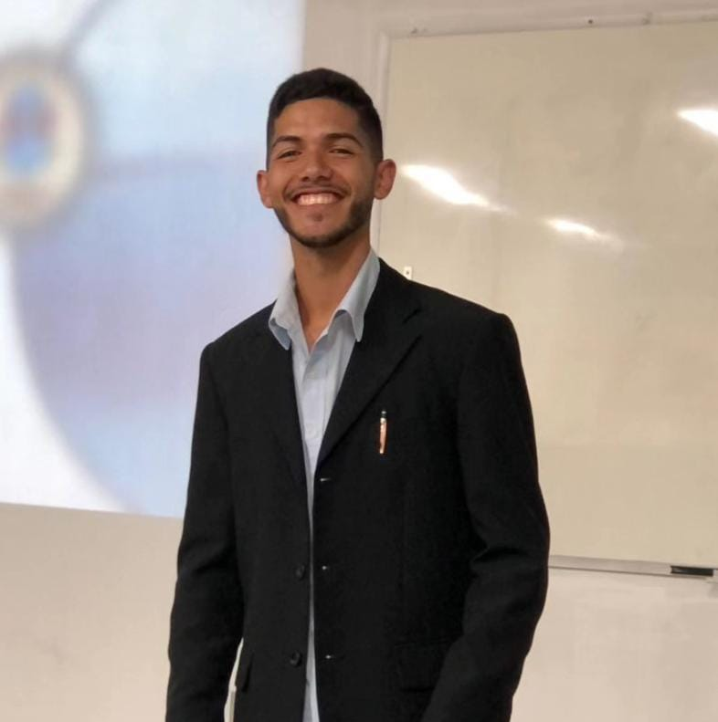

<!doctype html>
<html lang="pt-BR">
<head>
  <meta charset="utf-8"><meta name="viewport" content="width=device-width,initial-scale=1">
  <meta name="description" content="Portfólio acadêmico de Benicio Barbosa Cruz: engenharia elétrica, robótica, automação, controle e sistemas autônomos.">
  <meta name="theme-color" content="#f4f0e7"><title>Benicio Barbosa Cruz | Portfólio acadêmico</title>
  <link rel="icon" href="assets/favicon.svg" type="image/svg+xml"><link rel="stylesheet" href="styles.css">
</head>
<body>
<header class="nav-shell">
  <button class="mark" data-scroll="top" aria-label="Início">B<i></i></button>
  <button class="menu-button" id="menuButton">Menu</button>
  <nav id="nav"></nav>
  

<button class="active" data-lang="pt">PT</button>/<button data-lang="en">EN</button>
<a class="outline-button nav-cv" id="cvLink" target="_blank" rel="noopener" href="https://buscatextual.cnpq.br/buscatextual/visualizacv.do?id=K9795655T9">Currículo acadêmico ↗</a>

</header>
<main>
  <section class="hero" id="top">
    

<h1>Benicio Barbosa Cruz</h1><h2 id="role"></h2>

<button class="primary-button" data-scroll="publications" id="explore"></button><button class="outline-button" data-scroll="research" id="expertise"></button>

<b>Instituto Tecnológico de Aeronáutica</b><small id="location"></small>

    <figure class="portrait"><figcaption>Benicio Barbosa Cruz · ITA</figcaption></figure>
    

<b>8+</b>

<b>4</b>

<b>ITA / LRA</b>

  </section>
  <section class="about section" id="about">

<h2 id="aboutTitle"></h2>

ElectronicsRoboticsAutomationEmbedded systemsControlOptimizationComputer vision

<article class="biography">

<button id="bioToggle" aria-expanded="false"></button></article></section>
  <section class="research section dark" id="research">

<h2 id="areaTitle"></h2>

</section>
  <section class="publications section" id="publications">

<h2 id="pubsTitle"></h2>

<a target="_blank" rel="noopener" href="https://scholar.google.com/citations?view_op=list_works&hl=pt-BR&user=TgpVx6sAAAAJ">Google Scholar ↗</a><a target="_blank" rel="noopener" href="https://www.researchgate.net/profile/Benicio-Cruz">ResearchGate ↗</a><a target="_blank" rel="noopener" href="https://buscatextual.cnpq.br/buscatextual/visualizacv.do?id=K9795655T9">Currículo Lattes ↗</a><a target="_blank" rel="noopener" href="https://orcid.org/0009-0001-3008-727X">ORCID ↗</a>

<input id="pubSearch"><select id="yearFilter"></select>

</section>
  <section class="timeline section dark" id="experience">

<h2 id="expTitle"></h2>

</section>
  <section class="contact section" id="contact">

<h2 id="contactTitle"></h2>

<button class="outline-button" id="copyEmail"></button>
eng.beniciobarbosa@gmail.com
<a target="_blank" rel="noopener" href="https://scholar.google.com/citations?view_op=list_works&hl=pt-BR&user=TgpVx6sAAAAJ">Scholar</a><a target="_blank" rel="noopener" href="https://www.researchgate.net/profile/Benicio-Cruz">ResearchGate</a><a target="_blank" rel="noopener" href="https://orcid.org/0009-0001-3008-727X">ORCID</a><a target="_blank" rel="noopener" href="https://github.com/Benitronic">GitHub</a><button data-scroll="top" id="backTop"></button>
</section>
</main>
<footer>© 2026 Benicio Barbosa Cruz</footer>

</body></html>
